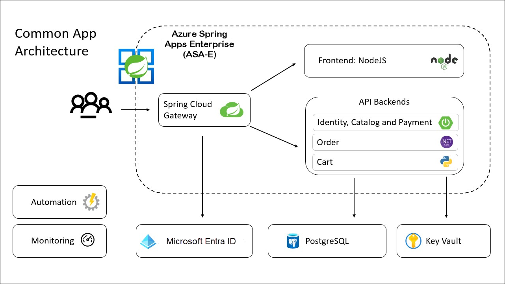

# Modernize Java Apps

## Overall Estimated Duration: 8 Hours

## Overview

The Acme-fitness application is an online shopping platform for having the best equipment to make you fit. This sample application comprises a variety of services, such as:

* Three Java Spring Boot applications:
  * A catalog service for fetching available products.
  * A payment service for processing and approving payments for users' orders.
  * An identity service for referencing the authenticated user.

* 1 Python application:
  * A cart service for managing a user's items that have been selected for purchase.

* 1 ASP.NET Core applications:
  * An order service for placing orders to buy products that are in the users' carts.

* 1 NodeJS and static HTML Application:
  * A front-end shopping application.

## Objectives
By the end of this lab, you will be able to:

* Understand the Application Architecture:
  * Learn about the different services that make up the Acme-fitness application, including Java Spring Boot, Python, ASP.NET Core, and NodeJS applications.

* Deploy and Manage the Acme-fitness Application:
  * Deploy the application services on the appropriate platforms.

* Manage the interactions between these services, including catalog, payment, identity, cart, order, front-end services and Integrate AI Capabilities.

## Architecture Diagram

## Lab Context
Throughout this hands-on lab, you will learn several things:

- Build and deploy both frontend and backend Spring applications to Azure Spring Apps.
- Configure Single Sign-On (SSO) for the application using Microsoft Entra ID.
- Create persistent stores (PostgreSQL and Azure Cache for Redis) outside the applications and connect those applications to those stores.
- Use Azure Key Vault to securely store and load secrets to connect to Azure services.
- Monitor applications using Application Insights and Log Analytic Workspace.
- Updating the source code of the application and the spring application.
- Use Spring Cloud Gateway filters to apply rate limiting to your API.
- Automate provisioning and deployments using GitHub Actions.

# Getting Started with Lab

1. Once the environment is provisioned, a virtual machine (JumpVM) and lab guide will get loaded in your browser. Use this virtual machine throughout the workshop to perform the lab. You can see the number on the bottom of the lab guide to switch to different exercises of the lab guide.

   

1. To get the lab environment details, select the **Environment Details** tab. The credentials will also be emailed to your registered email address. You can open the Lab Guide on a separate and full window by selecting the **Split Window** from the lower right corner. Also, you can start, stop and restart virtual machines from the **Virtual Machines** tab.

   
 
    > You will see the SUFFIX value on the **Environment Details** tab, use it wherever you see SUFFIX or DeploymentID in lab steps.

## Login to Azure Portal
1. In the JumpVM, click on the Azure portal shortcut of the Microsoft Edge browser which is created on the desktop.

   
   
1. On the **Sign into Microsoft Azure** tab you will see a login screen, enter the following email/username and then click on **Next**. 
   * Email/Username: <inject key="AzureAdUserEmail"></inject>
   
   
     
1. Now enter the following password and click on **Sign in**.
   * Password: <inject key="AzureAdUserPassword"></inject>
   
   
     
   > If you see the **Help us protect your account** dialog box, then select the **Skip for now** option.

   
  
1. If you see the pop-up **Stay Signed in?**, click No

1. If you see the pop-up **You have free Azure Advisor recommendations!**, close the window to continue the lab.

1. If a **Welcome to Microsoft Azure** popup window appears, click **Maybe Later** to skip the tour.
   
1. Now you will see the Azure Portal Dashboard, click on **Resource groups** from the Navigate panel to see the resource groups.

   
   
1. Confirm that you have all resource groups present as shown below. Open the **Modernize-java-apps** resource group and verify the resources present in it.

   
   
1. Now, click on the **Next** from the lower right corner to move to the next page.

## Support Contact
The CloudLabs support team is available 24/7, 365 days a year, via email and live chat to ensure seamless assistance at any time. We offer dedicated support channels tailored specifically for both learners and instructors, ensuring that all your needs are promptly and efficiently addressed.

Learner Support Contacts:

* Email Support: labs-support@spektrasystems.com
* Live Chat Support: https://cloudlabs.ai/labs-support
  
Now, click on Next from the lower right corner to move on to the next page.

# Happy Learning!!
