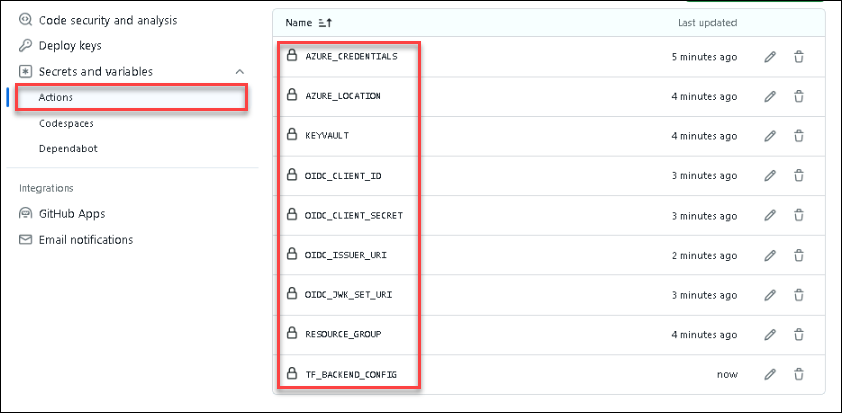

## Lab 7:  Automate from idea to production
Duration: 40 minutes

In this lab, you will use Spring Cloud Gateway filters to apply rate limiting to your API.

### Task 1: Prepare your environment for creating a Storage Account

1. Make sure you are operating from the ./scripts folder.

```shell
cd ../../../azure-spring-apps-enterprise/scripts/
pwd
```
2. Create a bash script with environment variables by making a copy of the supplied template:.

```shell
cp ./setup-storage-env-variables-template.sh ./setup-storage-env-variables.sh
```

3. Using an editor of your choice, edit the file, (for the purposes of example we will use the nano editor), and add the following values.

```shell
vi setup-storage-env-variables.sh 
```
Enter the following information:

```shell
export STORAGE_RESOURCE_GROUP='change-me'      # different resource group from previous steps
export STORAGE_ACCOUNT_NAME='change-me'        # choose a name for your storage account
```

> **Note:** Please provide resource group and storage account a unique name.

4. Then, set the environment.

```shell
source ./setup-storage-env-variables.sh
```

5. Create a resource group to hold the Storage Account.

```shell
az group create \
  --name ${STORAGE_RESOURCE_GROUP} \
  --location ${REGION}
```

6. Create a Storage Account in resource group.

```shell
az storage account create \
  --name ${STORAGE_ACCOUNT_NAME} \
  --resource-group ${STORAGE_RESOURCE_GROUP} \
  --location ${REGION} \
  --sku Standard_RAGRS \
  --kind StorageV2
```

7. Create a Storage Container within the Storage Account.

```shell
az storage container create \
    --name terraform-state-container \
    --account-name ${STORAGE_ACCOUNT_NAME} \
    --auth-mode login
```

8. Create a service principal with enough scope/role to manage your Azure Spring Apps instance.

```shell
az ad sp create-for-rbac --name "change-me" \
   --role contributor \
   --scopes /subscriptions/${SUBSCRIPTION} \
   --sdk-auth
```

  >**Note:** Make the name of the service principle something you will recognize.

9. Copy the Result and save it for later use.

```json
{
    "clientId": "<GUID>",
    "clientSecret": "<GUID>",
    "subscriptionId": "<GUID>",
    "tenantId": "<GUID>",
    "activeDirectoryEndpointUrl": "https://login.microsoftonline.com",
    "resourceManagerEndpointUrl": "https://management.azure.com/",
    "sqlManagementEndpointUrl": "https://management.core.windows.net:8443/",
    "galleryEndpointUrl": "https://gallery.azure.com/",
    "managementEndpointUrl": "https://management.core.windows.net/"
}
```
> This output will be needed as a secret value for the next step.   Save this off to a file, in a secure location that you can reference later.

### Task 2: Add Secrets to GitHub Actions

1. From the new browser tab, go to [GitHub](https://github.com/) and log in to your account.
    > **Note:** If you don't have an account for GitHub, please sign up.

1. After the login, go to [https://github.com/CloudLabsAI-Azure/acme-fitness-store-v2](https://github.com/CloudLabsAI-Azure/acme-fitness-store-v2) and click on `Fork`.

   
   
1. On the Create a new fork page, click on Create fork. 

1. Now you're going to add the secrets to your repo.

1. From your repo, click on **Settings**.

   

1. Find **Secrets and variables** **(1)** under _Security_ on the left side of menu, and click on **Actions** **(2)**. After that Click on **New repository secret** **(3)**.
  
   
   
1. Type `AZURE_CREDENTIALS` **(1)** for the Name of the secret, enter the following code under Secret and make sure to replace the values of **ClientId (Application Id)**, **ClientSecret (Secret Key)**, **Subscription_ID** and **TenantId (Directory ID)** **(2)** and then click on **Add Secret** **(3)**.   

     ```json
    {
        "clientId": "Application_ID",
        "clientSecret": "Application_secret",
        "subscriptionId": "Subscription_ID",
        "tenantId": "TENANT_ID",
        "activeDirectoryEndpointUrl": "https://login.microsoftonline.com",
        "resourceManagerEndpointUrl": "https://management.azure.com/",
        "sqlManagementEndpointUrl": "https://management.core.windows.net:8443/",
        "galleryEndpointUrl": "https://gallery.azure.com/",
        "managementEndpointUrl": "https://management.core.windows.net/"
    }
    ```
     
     >**Note:** You can copy the **ClientId (Application Id)**, **ClientSecret (Secret Key)**, **Subscription_ID** and **TenantId (Directory ID)** from the Environment details page > Service principal details.

   

1. In a similar way, you will add the following secrets to GitHub Actions:

   | Secret Name | Secret value|
   |:----------|:--------|
   | `RESOURCE_GROUP`| Provide the RG name **<inject key="Resource Group Name" />**|
   | `KEYVAULT`| Provide the Key vault name **<inject key="KeyVault Name" />**|
   | `AZURE_LOCATION` | Provide the region **<inject key="Region" />**|
   | `OIDC_JWK_SET_URI` | use the `JWK_SET_URI` |
   | `OIDC_CLIENT_ID` | use the `CLIENT_ID` |
   | `OIDC_CLIENT_SECRET` | use the `CLIENT_SECRET`|
   | `OIDC_ISSUER_URI` | use the `ISSUER_URI`|
 
    > **Note**: For the values of `OIDC_JWK_SET_URI`, `OIDC_CLIENT_ID`, `OIDC_CLIENT_SECRET`, `OIDC_ISSUER_URI`, enter the values you have copied in your text editor in Lab 2.


1. Add the secret `TF_BACKEND_CONFIG` to GitHub Actions with the value (replacing `${STORAGE_ACCOUNT_NAME}` and `${STORAGE_RESOURCE_GROUP}` with storage resource group)   > When Completed, you should see something like (8 Secrets) as in below image provided:

   ```text
   resource_group_name  = "${STORAGE_RESOURCE_GROUP}"
   storage_account_name = "${STORAGE_ACCOUNT_NAME}"
   container_name       = "terraform-state-container"
   key                  = "dev.terraform.tfstate"
   ```
    

1. From the forked repo, click on **Actions**.

1. Select **Deploy catalog** (1) under __Actions_ All workflows_ from the left side panel and click on **Run workflow** (2). After that Click on **Run workflow** (3) under _Branch: Azure_.

   

1. Each application has a `Deploy` workflow that will redeploy the application when changes are made to that application. An example output from the catalog service is shown below:

   

> Now, click on **Next** in the lab guide section in the bottom right corner to jump to the next exercise instructions.
