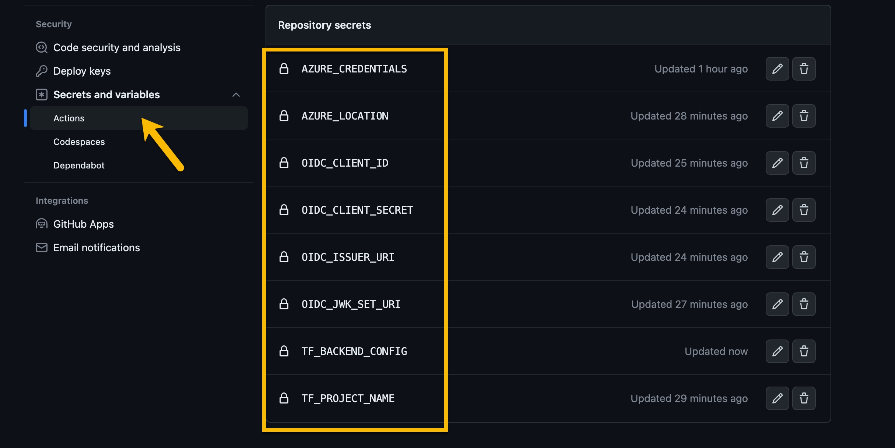

## Lab 7:  Automate from idea to production
Duration: 40 minutes

In this lab, you will use Spring Cloud Gateway filters to apply rate limiting to your API.

### Task 1: Prepare your environment for creating a Storage Account

1. Make sure you are operating from the ./scripts folder.

```shell
cd ./scripts
pwd
```
2. Create a bash script with environment variables by making a copy of the supplied template:.

```shell
cp ./setup-storage-env-variables-template.sh ./setup-storage-env-variables.sh
```

3. Using an editor of your choice, edit the file, (for the purposes of example we will use the nano editor), and add the following values.

```shell
vi `setup-storage-env-variables.sh` 
```
Enter the following information:

```shell
export STORAGE_RESOURCE_GROUP='change-me'      # different resource group from previous steps
export STORAGE_ACCOUNT_NAME='change-me'        # choose a name for your storage account
```

4. Then, set the environment.

```shell
source ./setup-storage-env-variables.sh
```

5. Create a resource group to hold the Storage Account.

```shell
az group create \
  --name ${STORAGE_RESOURCE_GROUP} \
  --location ${REGION}
```

6. Create a Storage Account in resource group.

```shell
az storage account create \
  --name ${STORAGE_ACCOUNT_NAME} \
  --resource-group ${STORAGE_RESOURCE_GROUP} \
  --location ${REGION} \
  --sku Standard_RAGRS \
  --kind StorageV2
```

7. Create a Storage Container within the Storage Account.

```shell
az storage container create \
    --name terraform-state-container \
    --account-name ${STORAGE_ACCOUNT_NAME} \
    --auth-mode login
```

8. Create a service principal with enough scope/role to manage your Azure Spring Apps instance.

```shell
az ad sp create-for-rbac --name "change-me" \
   --role contributor \
   --scopes /subscriptions/${SUBSCRIPTION} \
   --sdk-auth
```

  >**Note:** Make the name of the service principle something you will recognize.

9. Copy the Result and save it for later use.

```json
{
    "clientId": "<GUID>",
    "clientSecret": "<GUID>",
    "subscriptionId": "<GUID>",
    "tenantId": "<GUID>",
    "activeDirectoryEndpointUrl": "https://login.microsoftonline.com",
    "resourceManagerEndpointUrl": "https://management.azure.com/",
    "sqlManagementEndpointUrl": "https://management.core.windows.net:8443/",
    "galleryEndpointUrl": "https://gallery.azure.com/",
    "managementEndpointUrl": "https://management.core.windows.net/"
}
```
> This output will be needed as a secret value for the next step.   Save this off to a file, in a secure location that you can reference later.

### Task 2: Add Secrets to GitHub Actions

1. Click on acme repository > click on settings. scroll down in the left hand and click on click on secrets and variables under security, click on Actions and on the right click on new repository secret.  

2. Create the Service Principal Secret with JSON from previous step in secret. provide the name to the secret as below mentioned and paste the secret copied earlier as a json value in secret section.

```text
AZURE_CREDENTIALS
```
  >**Note**: Add the above generated json value to it

3. Create your Terraform Project Name Secret, with the value of your choosing.
```text
TF_PROJECT_NAME
```
4. Create your Azure Location Secret, with Region your resources are currently created in.
```text
AZURE_LOCATION
```
5. Create your OIDC_JWK_SET_URI Secret, with use the `JWK_SET_URI`.
Defined in [Unit 2], also available as an Environment Variable.
```text
OIDC_JWK_SET_URI
```
6. Create your OIDC_CLIENT_ID Secret, with use the `CLIENT_ID`.
Defined in [Unit 2], also available as an Environment Variable.
```text
OIDC_CLIENT_ID
```
7. Create your OIDC_CLIENT_SECRET Secret, with use the `CLIENT_SECRET`. 
Defined in [Unit 2], also available as an Environment Variable.
```text
OIDC_CLIENT_SECRET
```
8. Create your OIDC_ISSUER_URI Secret, with use the `ISSUER_URI`
Defined in [Unit 2], also available as an Environment Variable.
```text
OIDC_ISSUER_URI
```
9. Create your TF_BACKEND_CONFIG Secret.

Secret Key:
```text
TF_BACKEND_CONFIG
```

Secret Value:
```text
resource_group_name  = "${STORAGE_RESOURCE_GROUP}"
storage_account_name = "${STORAGE_ACCOUNT_NAME}"
container_name       = "terraform-state-container"
key                  = "dev.terraform.tfstate"
```
   >**Note**: Using the key & value from the blocks below, replace the values STORAGE_ACCOUNT_NAME and STORAGE_RESOURCE_GROUP with the current values from your environment variables.

10. Once the gitHub actions secrets completed. run the workflow by following from the step 11 below.

> When Completed, you should see something like (8 Secrets)



11. Run GitHub Actions workflow, click on **Actions** to navigate to workflow. click on **I understand my workflows, go ahead and enable them**.
    
12. On the lefthand side in the actions tab. click on Provision, on the right click on **run workflow** dropdown and click on **run workflow**. make sure you have branch selected as Azure.
    
13. once the provision run workflow successfully runs, perform the same steps for **Deploy Catalog** and **Cleanup** workflow.  

> Now, click on **Next** in the lab guide section in the bottom right corner to jump to the next exercise instructions.
