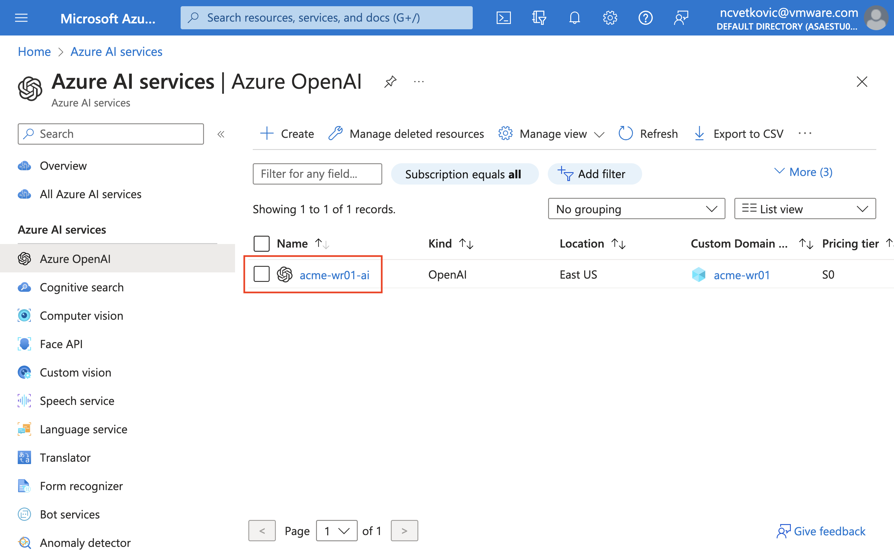
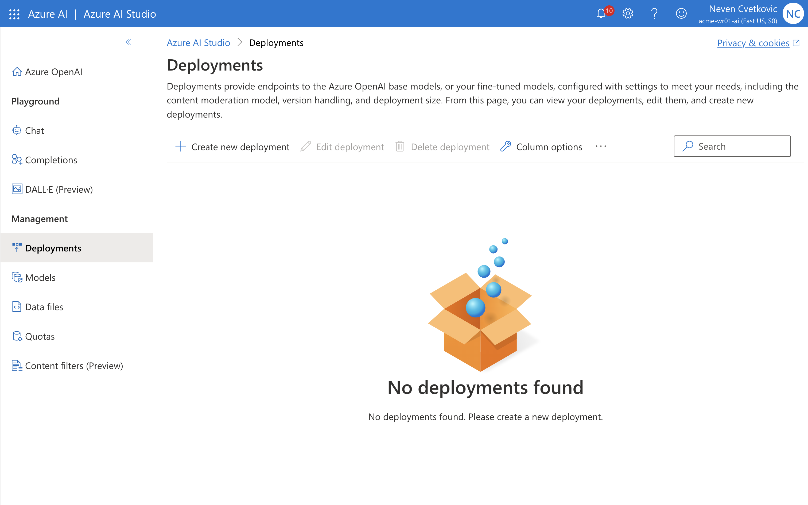
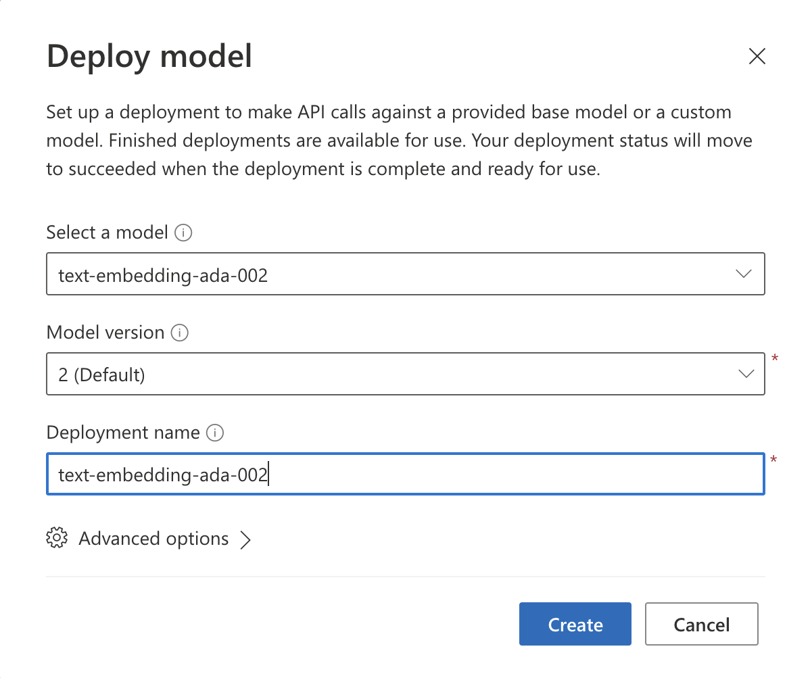
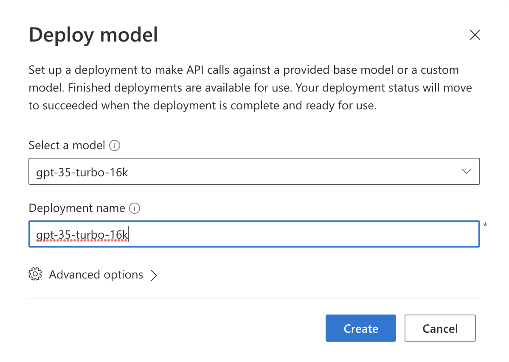
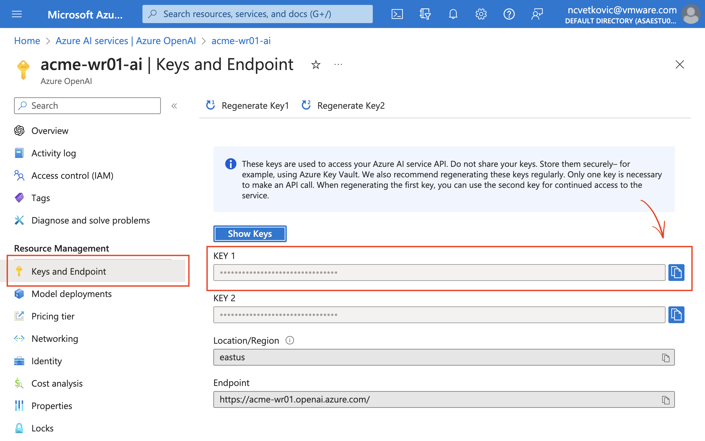
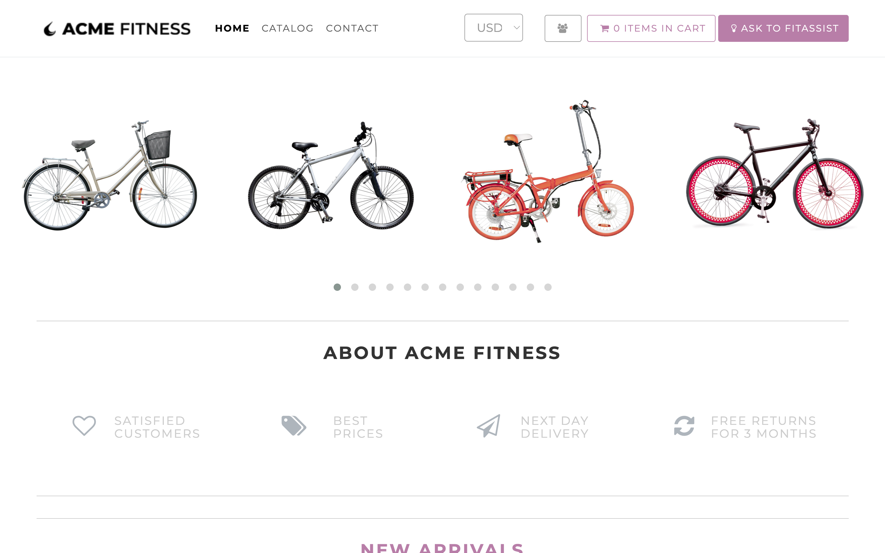
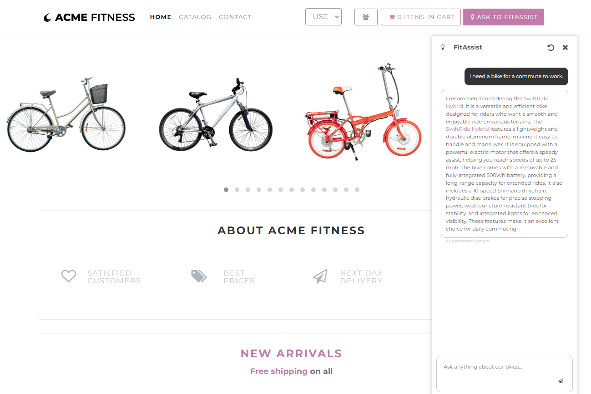

## Lab 8: Infuse AI into Fitness Store

Duration: 30 minutes

### Prerequisites
- JDK 17
- Python 3
- Maven
- Azure CLI
- An Azure subscription with access granted to Azure OpenAI (request access to Azure OpenAI [here](https://customervoice.microsoft.com/Pages/ResponsePage.aspx?id=v4j5cvGGr0GRqy180BHbR7en2Ais5pxKtso_Pz4b1_xUOFA5Qk1UWDRBMjg0WFhPMkIzTzhKQ1dWNyQlQCN0PWcu))

### Task 1: Prepare the Environment Variables

1. Please navigate to the root folder of this cloned repository.

2. Copy the AI environment variables template file, make sure you are in ./scripts directory.

```bash
 cp ./setup-ai-env-variables-template.sh ./setup-ai-env-variables.sh
```

3. Update the values in `./setup-ai-env-variables.sh` with your own values, as configured in Azure OpenAI instance:

```bash
  vi setup-ai-env-variables.sh
```
 - Name, e.g. `my-ai`
 - Endpoint, e.g. `https://my-ai.openai.azure.com`
 - Chat deployment ID, e.g. `gpt-35-turbo-16k``
 - Embedding deployment ID, e.g. `text-embedding-ada-002``
 - OpenAI API Key, to be updated once you create AI instance (in next step)

### Task 2: Prepare Azure OpenAI 

1. Run the following command to create an Azure OpenAI resource in the the resource group.

```bash
   source ./setup-env-variables.sh
   export OPENAI_RESOURCE_NAME=<choose-a-resource-name>
   az cognitiveservices account create \
      -n ${OPENAI_RESOURCE_NAME} \
      -g ${RESOURCE_GROUP} \
      -l eastus \
      --kind OpenAI \
      --sku s0 \
      --custom-domain ${OPENAI_RESOURCE_NAME}   
```
   
   > You can check the resource has been created in Azure Portal under `Azure AI Services`, e.g.

   

2. Create the model deployments for `text-embedding-ada-002` and `gpt-35-turbo-16k` in your Azure OpenAI service.
   
```bash
  az cognitiveservices account deployment create \
     -g ${RESOURCE_GROUP} \
     -n ${OPENAI_RESOURCE_NAME} \
     --deployment-name text-embedding-ada-002 \
     --model-name text-embedding-ada-002 \
     --model-version "2"  \
     --model-format OpenAI \
     --scale-type "Standard" 

  az cognitiveservices account deployment create \
     -g ${RESOURCE_GROUP} \
     -n ${OPENAI_RESOURCE_NAME} \
     --deployment-name gpt-35-turbo-16k \
     --model-name gpt-35-turbo-16k \
     --model-version "0613"  \
     --model-format OpenAI \
     --scale-type "Standard"
```

   > Alternatively, you can click go to the link, e.g. https://oai.azure.com/

   

   

   

3. Update the values in `scripts/setup-ai-env-variables.sh`, e.g.
    * for Endpoint and API KEY - check under Azure Portal OpenAI instances in `Keys and Endpoint` section
        
    * for `AI_APP` use default name, e.g. `assist-service`
    
4. You can get the endpoint by querying the `cognitiveservices` from Azure CLI, e.g.

```bash
   az cognitiveservices account show \
     --name ${OPENAI_RESOURCE_NAME} \
     --resource-group ${RESOURCE_GROUP} \
     --output json | jq -r '.properties.endpoint' 
```

### Task 3: Build and Deploy Assist app to Azure Spring Apps

1. Configure AI environment variables, e.g. 

```bash
   source ./setup-ai-env-variables.sh
```

2. Create the new AI service `assist-service`, e.g.

```bash    
    az spring app create --name ${AI_APP} --instance-count 1 --memory 1Gi
```

3.  Configure Spring Cloud Gateway with the `assist-service` routes, e.g.

```bash
    az spring gateway route-config create \
        --name ${AI_APP} \
        --app-name ${AI_APP} \
        --routes-file /azure-spring-apps-enterprise/resources/json/routes/assist-service.json
```
    
4. Deploy the application, e.g. 

```bash
    az spring app deploy --name ${AI_APP} \
        --source-path /apps/acme-assist \
        --build-env BP_JVM_VERSION=17 \
        --env \
            SPRING_AI_AZURE_OPENAI_ENDPOINT=${SPRING_AI_AZURE_OPENAI_ENDPOINT} \
            SPRING_AI_AZURE_OPENAI_API_KEY=${SPRING_AI_AZURE_OPENAI_API_KEY}
```

   >**Note:** For routes-file and source-path if you face any issues please crosscheck the paths and do modify the line of code accordingly for the route-file and source-path if command not able to find.

5. Test the `acme-fitness` application in the browser again. Go to `ASK TO FITASSIST` and converse with the assistant, e.g.

```
   I need a bike for a commute to work.
```

   

6. Observe the output that was generated by the Assist application, e.g.

   

   >**Note:** Output of the AI generated texts can be vary from the output shown in the image.

## **Congratulations! you have successfully completed the lab.**
